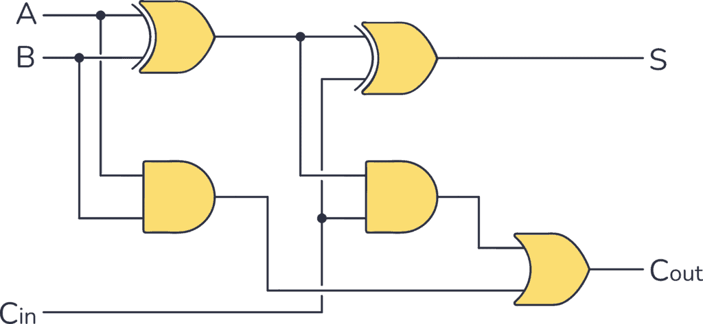
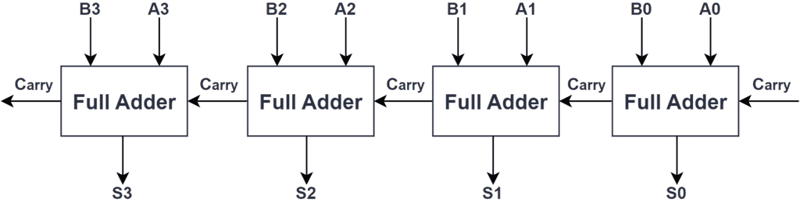

## --- Day 24: Crossed Wires ---
You and The Historians arrive at the edge of a [large grove](/2022/day/23) somewhere in the jungle. After the last incident, the Elves installed a small device that monitors the fruit. While The Historians search the grove, one of them asks if you can take a look at the monitoring device; apparently, it's been malfunctioning recently.

The device seems to be trying to produce a number through some boolean logic gates. Each gate has two inputs and one output. The gates all operate on values that are either <em>true</em> (<code>1</code>) or <em>false</em> (<code>0</code>).

_Visit the website for the full story and [full puzzle](https://adventofcode.com/2024/day/24) description._

The first half of the problem was a familiar logic circuit evaluator, we have done this before. I really liked the second part, although I don't have a super generic solution for it. I generated a graph from my input using Graphviz, then realized that the circuit tries to implement a full adder.

A single full adder consists of two half adders:

Which are chained one after the other like this:

I took the images from [build-electronic-circuits.com](https://www.build-electronic-circuits.com/full-adder/).

I implemented this logic in my 'fix' method. I start with the output x01 and y01 and try to identify the gates for the individual steps. Where I found an error, I manually checked my input to figure out what went wrong. I had just two different
kind of errors which can be corrected by the fixer.