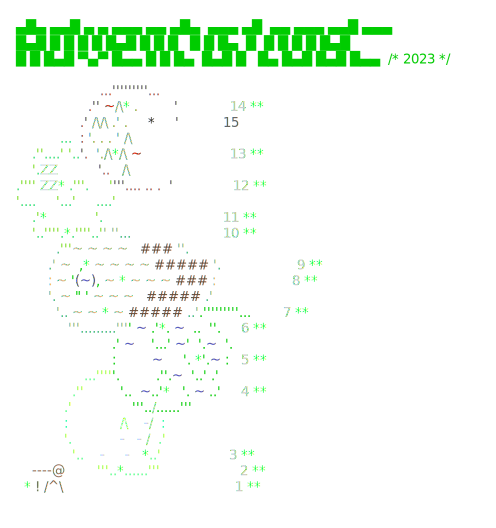

# Advent of Code (2015-2023)
C# solutions to the Advent of Code problems.
Check out https://adventofcode.com.

<a href="https://adventofcode.com"></a>

The goal is to keep my C# knowledge fresh and to follow the latest changes of the language.

Everything is self contained. I don't use any libraries to make things short or predefined algorithms 
to parameterize. Just stick to what .Net provides. Each problem is solved by plain C# classes without any 'base' to derive from.
The solvers have different entry points for part 1 and 2. There is no local state, part 2 starts from scratch, 
but code sharing between part 1 and 2 is important to me. (Unless it makes things hard to read.)

I prefer to use functional style, local or anonymous functions, immutability and linq over the state manipulation 
style of oop, but I'm not very strict about this. Whatever I see fit for the problem.

One thing that you will not see much in C# projects is K&R indentation. Sorry about that...

The way I solve the puzzles should be pretty consistent during an event but there are small changes over 
the years as I find something new or forget about stuff I learned last year.

I try to keep things tight and golf the solution to a certain level, but don't want to overgolf it. (Sometimes I fail.)

There aren't many comments, but if I find that the solution is not straightforward, the algorithm has a name, or it is 
using some special property of the input I might explain it in a line or two. 

You can browse my solutions as they are or fork the repo, remove everything and use just the lib part to 
start working on your own. The framework part is pretty stable and you get testing, scaffolding etc for free.

## Dependencies

- This project is based on `.NET 8`  and `C# 12`. It should work on Windows, Linux and OS-X.
- `AngleSharp` is used for problem download.

## Running

To run the project:

1. Install .NET Core
2. Clone the repo
3. Get help with `dotnet run`
```

Usage: dotnet run [arguments]
1) To run the solutions and admire your advent calendar:

 [year]/[day|all]      Solve the specified problems
 today                 Shortcut to the above
 [year]                Solve the whole year
 all                   Solve everything

 calendars             Show the calendars

2) To start working on new problems:
login to https://adventofcode.com, then copy your session cookie, and export 
it in your console like this

 export SESSION=73a37e9a72a...

then run the app with

 update [year]/[day]   Prepares a folder for the given day, updates the input,
                       the readme and creates a solution template.
 update today          Shortcut to the above.

3) To upload your answer:
set up your SESSION variable as above.

 upload [year]/[day]   Upload the answer for the selected year and day.
 upload today          Shortcut to the above.


```

## Working in Visual Studio Code
If you prefer, you can work directly in VSCode as well. 
 
 Open the command Palette (⇧ ⌘ P), select `Tasks: Run Task` then e.g. `update today`.

 Work on part 1. Check the solution with the `upload today` task. Continue with part 2.

 **Note:** this feature relies on the "Memento Inputs" extension to store your session cookie, you need 
 to set it up in advance from the Command Palette with `Install Extensions`.
