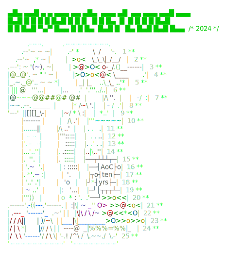

   # Advent of Code (2015-2024)
   C# solutions to the [Advent of Code](https://adventofcode.com) problems. 

   

   I'm making a [website](https://aoc.csokavar.hu) out of this. 
   
   A lot of effort goes into my solutions spending
   time on presenting things in an easy to understand and elegant way. The solutions might
   not be the most effective or shortest, but hopefully more readable.
   
   The framework I'm using is freely available and it's pretty streamlined by now. You can start with the 
   https://github.com/encse/adventofcode-template repository.

   Like what you see? Consider [sponsoring](https://github.com/sponsors/encse) me.

   ## Dependencies
   - Based on `.NET 9` and `C# 13`. 
   - `AngleSharp` is used for problem download.
   - git-crypt to store the input files in an encrypted form
